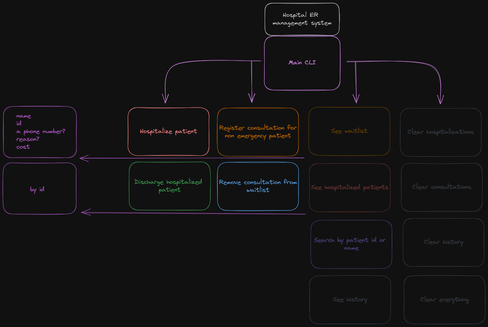
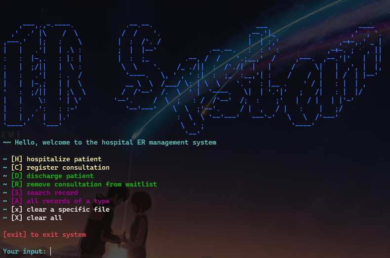

# Hospital ER management system

A cli tool for managing hospital records in the ER.



## How to run

* In a terminal just execute the build.ps1 and its going to create the *hospital_system* executable

```shell
./build.ps1
```

* Alternatively compile the necessary files without the build script, an example:

```shell
gcc .\src\system.c .\src\records\record.c .\src\file_manager\file_manager.c .\src\cli_printer\io.c .\src\utils\utils.c -o hospital_system
```

* then just run the executable and you are done!

```shell
./hospital_system
```

## How it looks

(dont mind my wallpaper)



### to hospitalize a patient by id (register consultation is the same)


### to discharge a patient by id (remove consultation from waitlist is the same)


### search records by id or name (searching in a specific file hospitalization/consultation/history)


### to see all records in a specific file (hospitalization/consultation/history)


### delete specific files or all files at once


#### Thank you for your time! [My porfolio](https://maxogod.github.io/)
